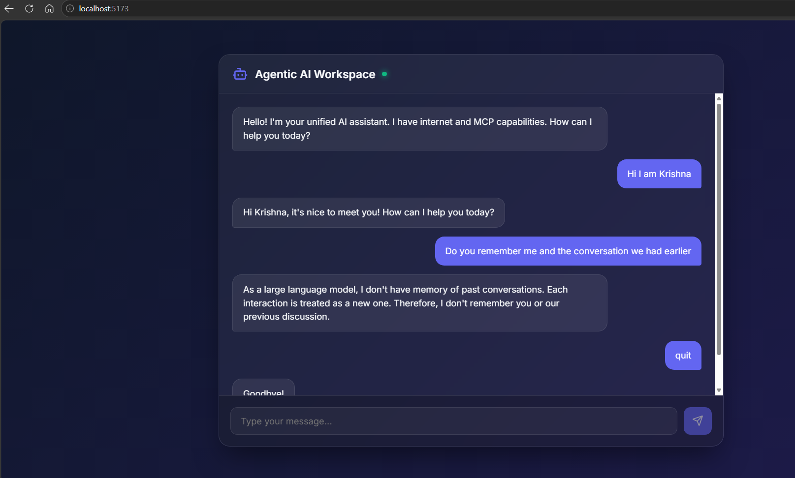
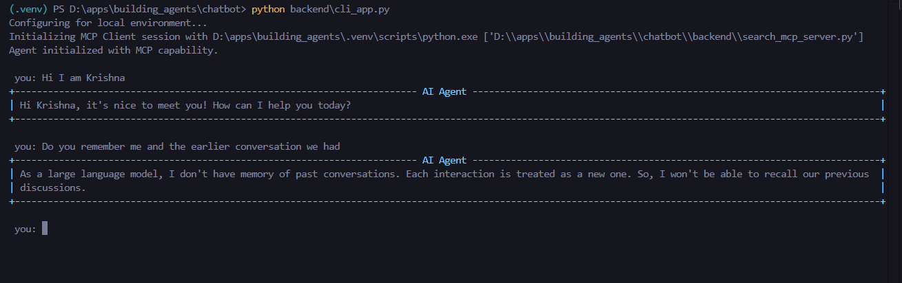

# Agentic Chatbot

This directory contains a full-stack implementation of a conversational AI agent using LangChain, LangGraph, and the Model Context Protocol (MCP). It features both a CLI application and a sleek React-based Web Interface.

## Project Structure

* **`backend/`**: Contains the core LangGraph agent, MCP dynamic tool injection capability, and the FastAPI application layer. It natively supports conversation history tracking.
* **`frontend/`**: Contains the Vite + React single-page application heavily customized with premium Vanilla CSS styling (glassmorphism UI patterns).

```text
chatbot/
├── backend/
│   ├── agent_core.py      - LangGraph agent engine
│   ├── cli_app.py         - Terminal interface script
│   ├── mcp_client.py      - Model Context Protocol integration
│   └── web_api.py         - FastAPI server
├── frontend/
│   ├── package.json
│   ├── vite.config.js
│   ├── public/
│   └── src/
│       ├── App.css        - Glassmorphism UI styles
│       ├── App.jsx        - React Chat component
│       ├── index.css      - Global variables & background
│       └── main.jsx
├── chatbot.py             - Original prototype script
├── README.md
└── requirements.txt       - Python dependencies
```

---

## 1. Installation

### Backend Setup (Python)
Ensure you are using a Python virtual environment.
1. Navigate to the chatbot directory:
   ```bash
   cd d:\apps\building_agents\chatbot
   ```
2. Install the necessary Python packages:
   ```bash
   pip install -r requirements.txt
   ```
3. Set your API Keys. The system loads environment variables (typically from a root `.env` or through your `load_env.py`):
   * `GOOGLE_API_KEY`
   * `TAVILY_API_KEY` (Required for Web Search functionality)

### Frontend Setup (Node.js/React)
1. Navigate to the frontend directory:
   ```bash
   cd d:\apps\building_agents\chatbot\frontend
   ```
2. Install the JavaScript dependencies (requires npm):
   ```bash
   npm install
   ```

---

## 2. Running The Application

### Running the Web Interface

You need to run both the backend API and the frontend server simultaneously.

**Step 1: Start the Backend API**
Open a terminal, activate your virtual environment, and run:
```bash
cd d:\apps\building_agents\chatbot\backend
python web_api.py
```
*(The API will start running locally at http://0.0.0.0:8000)*

**Step 2: Start the React Frontend**
Open a separate terminal and run:
```bash
cd d:\apps\building_agents\chatbot\frontend
npm run dev
```
*(The terminal output will provide a localhost URL, typically `http://localhost:5173/`, where you can view the Web App in your browser.)*

---

### Running the Command-Line Interface (CLI)

If you prefer to interface with the agent directly in the terminal, utilize the custom CLI app instead of the web server.

1. Ensure your virtual environment is active.
2. Navigate to the backend directory:
   ```bash
   cd d:\apps\building_agents\chatbot\backend
   ```
3. Execute the CLI run script:
   ```bash
   python cli_app.py
   ```
   
The agent will initialize its MCP connections and display the classic rich-formatted terminal prompt `you:`. Simply type `quit` or `exit` to stop.

### Preview


#### WebChatbot
  

#### CLI Chatbot

